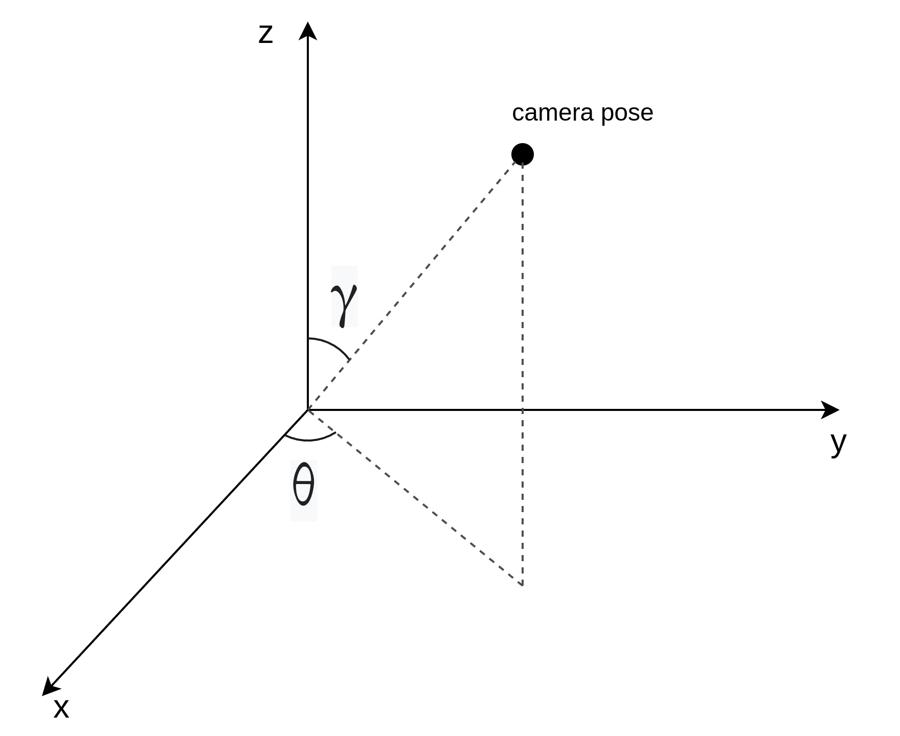
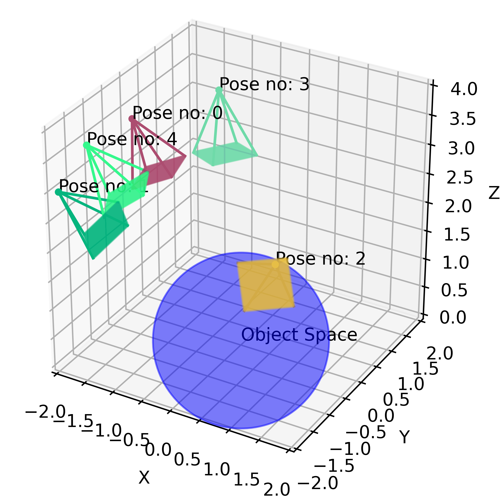
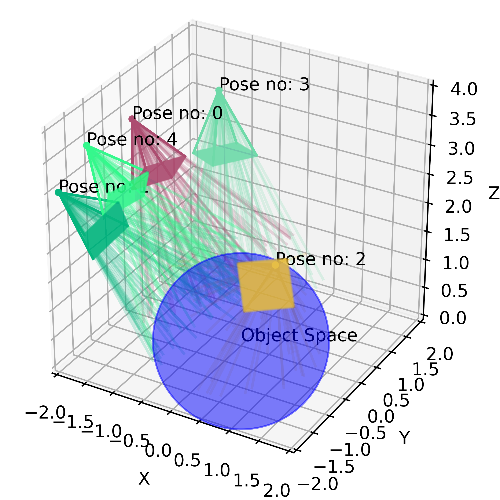
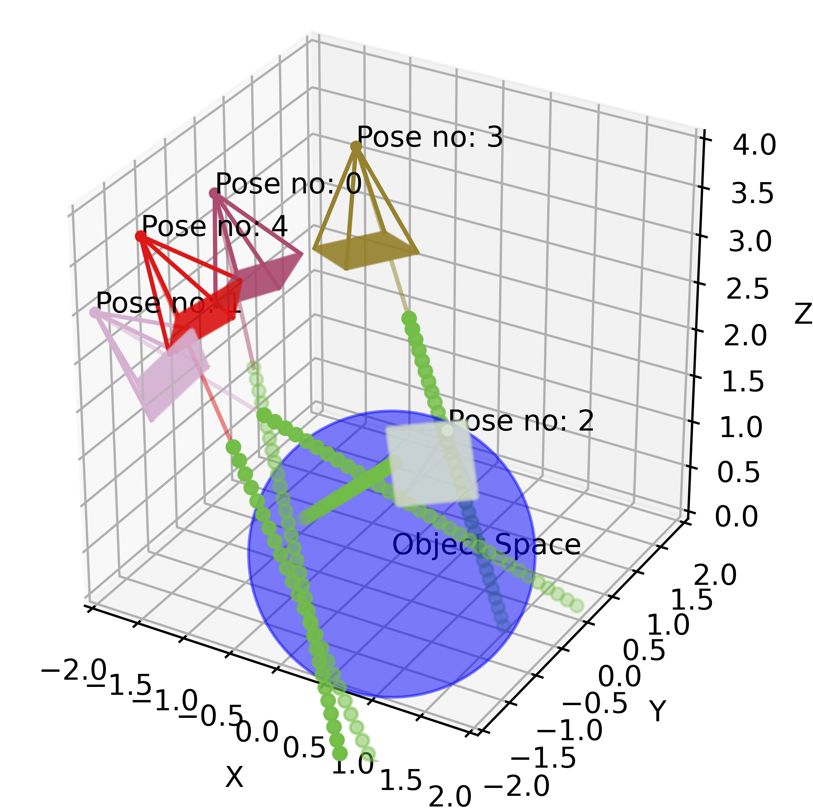
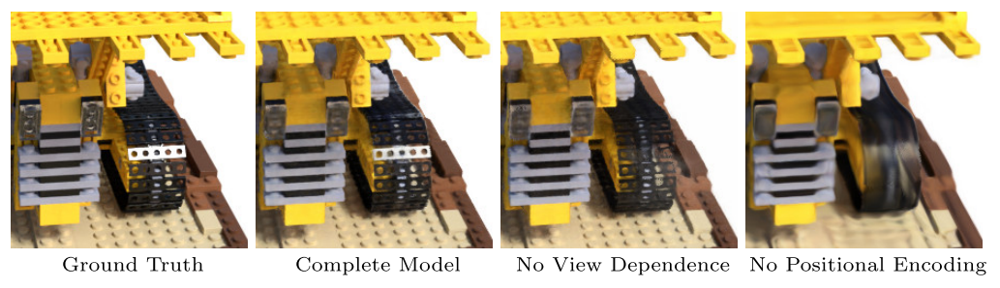
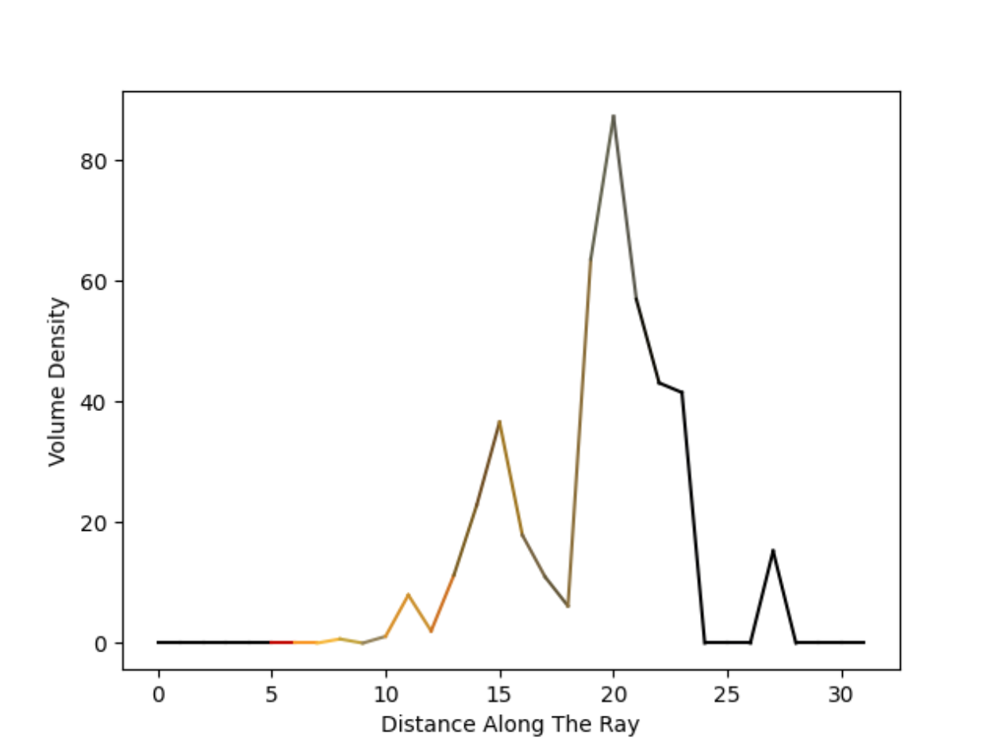

# Deep Dive into NeRF (Neural Radiance Fields)

> Reference: https://dtransposed.github.io/blog/2022/08/06/NeRF/

The goal of NERF is to render high-quality images conditioned on the pose of the observer (the camera). NeRF is an example of a neural rendering technique. We explicitly control one of the properties of the scene, i.e., the pose of the observer, to obtain rendered images corresponding to that pose. The model learns a continuous volumetric scene function, that can assign a color and volume density to any voxel in the space. The network’s weights are optimized to encode the representation of the scene so that the model can easily render novel views seen from any point in space.

Think about it as “distilling” (蒸馏) or “compressing” the information about some 3D space, like your apartment for instance, into a very tiny set of parameters (the parameters of NeRF).

### Step 1: Marching the Camera Rays Through the Scene (让摄像机光线穿过场景)

- **Input**: A set of camera poses $\{x_c, y_c, z_c, \gamma_c, \theta_c \}_n$
- **Output**: A bundle of rays for every pose $\{\textbf{v}_c, \textbf{v}_d\}_{H \times W \times n}$

Let’s look at the problem setup. The object that we want to render is located in the point $(0, 0, 0)$ (world coordinates). The object is placed in a 3D scene, which we will call the object space. A camera is fixed in the space at the position $\{x_c, y_c, z_c\}$. Since the camera is always “aimed” at the object, we only need two more rotation parameters to fully describe the pose: the inclination (倾角) and azimuth (方位角) angles $\{\gamma_c, \theta_c \}$. In the dataset, we have $n$ pairs of poses, together with the corresponding ground truth images.

In front of the camera, we place the image plane. Intuitively, the image plane is our “canvas”, this is where all the 3D information from the rays will be aggregated to render a 2D image (3D to 2D projection). The size of the image plane is $H \times W$.

Now, we “shoot” a bundle of rays from the camera, through every pixel of the image plane, resulting in $H \times W$ rays per pose.

Every ray is described by two vectors:

- $\textbf{v}_o$, a vector that specifies the origin of the ray. Note that $\textbf{v}_o = (x_c, y_c, z_c)$.
- $\textbf{v}_d$, a normalized vector that specifies the direction of the ray.

Parametric equation $P = \textbf{v}_o + t * \textbf{v}_d$ defines any point on the ray. So to do the “ray marching”, we make the $t$ parameter larger (thus extending our rays) until a ray reaches some interesting location in the object space.

Now we are casting rays from every camera (observer), as is shown in figure above. This type of ray-tracing process described above is called backward tracing. This is because we follow the path of light rays from the camera to the object, rather than from the light source to the object.

### Step 2: Collecting Query Points

- **Input**: A bundle of rays for every pose $\{\textbf{v}_c, \textbf{v}_d\}_{H \times W \times n}$
- **Output**: A set of 3D query points $\{x_p, y_p, z_p \}_{n \times m \times H \times W}$

In computer graphics, the 3D scene is very often modeled as a set of tiny, discrete region “cubes” called voxels (
3D 场景通常被建模为一组微小的、离散的区域“立方体”，称为体素). When a ray “flies” through the scene, it will pass through a large number of points in space. Most of those points represent “emptiness” (空虚), however, some may land on the object volume itself. The latter points are very valuable to us - they give us some knowledge about the scene. To render an image we will query the trained neural network, whether a point, some tiny piece of scene volume, belongs to the object or not, and more importantly, which visual properties it has. We can intuitively see that sampling points along a ray is not trivial. If we sample a lot of points that do not belong to the object space we won’t get any useful information. Still, if we only sample some high-volume density regions (points around the mode of the volume density distribution), we may miss out on some other interesting areas.

In our toy example, we sample uniformly along the ray (for every ray we sample $m$ points). But for better performance, authors use “hierarchical volume sampling” (分层体积采样) to allocate samples proportionally to their expected effect on the final rendering. For more details, refer to the original paper.

### Step 3: Projecting Query Points to High-Dimensional Space (Positional Encoding)

- **Input**: A set of 3D query points $\{x_p, y_p, z_p \}_{n \times m \times H \times W}$

- **Output**: A set of query points embedded into $d$-dimensional space $\{x_1, x_2, \cdots, x_d \}_{n \times m \times H \times W}$

Once we collect the query points for every ray, we are potentially ready to feed them into the neural network. However, the authors of the paper argue, that before the inference step, it is beneficial to map the query points to a high-dimensional space. The mapping is very particular - it uses a set of high-frequency functions.

> It is a well-known fact, that neural networks (after all - universal function approximators) are much better at approximating low-frequency, rather than high-frequency functions (众所周知，神经网络（毕竟是通用函数逼近器）更擅长逼近低频函数，而不是高频函数).

This observation is very important in the context of NeRF. The high-frequency features, such as colors, detailed geometry, and texture, make images perceptually sharp and vivid for the human eye. If our network is unable to represent those properties, the resulting The image may look bleak or over-smoothed. However, the way the network improves over time is similar to watching an object emerge from the fog. First, we see a general silhouette, its coarse outline, and dominant colors. Only later we might notice details, texture, and more fine-grained elements of an object.

The authors claim that mapping the inputs to a higher dimensional space using high-frequency functions before passing them to the network enables better fitting of data that contains high-frequency variation. In our example, we use two functions - sine and cosine - to embed the points in high-dimensional space.

For instance, if $p = (x_p, y_p, z_p) = (−0.039,−1.505,−1.316)$, an ecnoding function $F(p)$ could be:

$$
\begin{aligned}
F(p) & = (sin(\pi p), cos(\pi p), sin(2\pi p), cos(2\pi p)) = (\\ 
&[−0.039,−0.998,−0.968], \\
&[0.999,0.065,0.251], \\ 
&[−0.079,−0.123,−0.486], \\ 
&[0.997,−0.992,−0.874])
\end{aligned}
$$

### Step 4: Neural Network Inference

- **Input**: A set of query points embedded into $d$-dimensional space $\{x_1, x_2, \cdots, x_d \}_{n \times m \times H \times W}$
- **Output**: RGB colour and volume density for every query point $\{RGB, \sigma \}_{n \times m \times H \times W}$

We feed the representation of query points into the NeRF network. The network returns the RGB value (tuple of three values in the range from 0 to 1) and volume density (a single, positive integer) for every point. This allows us to compute the volume density profile for every ray.

An example of density profile for a single ray. This profile comes from the trained network that learns to represent the yellow lego bulldozer. We can see that the ray initially "flies" through the space unoccupied by voxels (first five points). Then, once it hits some red voxel (I assume it is the red beacon on top of the vehicle), it starts "penetrating" the volume of the bulldozer's cabin (volume density takes non-zero values). Most of the voxels inside the object are yellow, orange, and brownish. Finally, the ray leaves the object (and volume density returns to approximately zero).

### Step 5: Volume Rendering
- **Input**: A set of 3D query points (after positional encoding) + their volume profile + RGB value $\{x_1, x_2, \cdots, x_d, RGB, \sigma \}_{n \times m \times H \times W}$
- **Output**: A set of rendered images (one per pose) $\{H, W\}_n$

Next, we may turn the volume density profile along a ray into a pixel value. Then we repeat the process for every pixel in the image and voila, we have just rendered the image.

To aggregate the information from all the points along a single ray, we use the classical equation from computer graphics, the rendering equation. It is an integral equation in which the equilibrium radiance leaving a point is given as the sum of emitted plus reflected radiance under a geometric optics approximation.

In the context of NeRF, because we use straight rays and approximate the integral using samples, this seemingly perplexing integral can be simplified to a very elegant sum.

### Loss
- **Input**: A set of rendered images (one per pose) $\{H, W \}_n$ and a set of ground truth images (one per pose) $\{H, W \}^{gt}_n$
- **Output**: L2 loss between the inputs, a single scalar $\{l \}_n$

Finally, we compute the loss by comparing the pixels of the rendered image with the pixels of the ground truth image. Then we backpropagate this loss to optimize the weights of the network.

