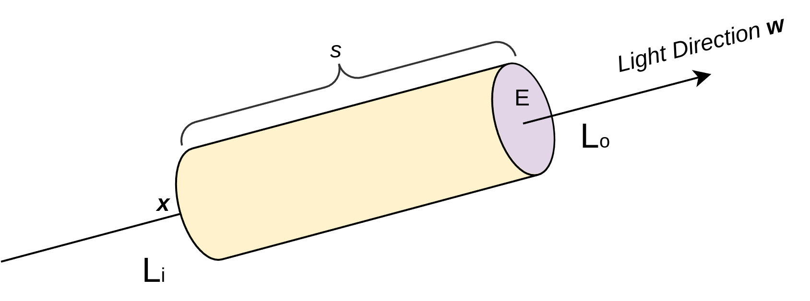

## 体渲染（Volume Rendering）

> 摘要: 本文档期望讲解体渲染的基本原理和公式推演，为NeRF中的公式提供前置知识储备。 Reference: http://www.yindaheng98.top/%E5%9B%BE%E5%BD%A2%E5%AD%A6/%E4%BD%93%E6%B8%B2%E6%9F%93.html#%E4%BD%93%E6%B8%B2%E6%9F%93-volume-rendering

### 1. NeRF 中的体渲染
NeRF中的DNN输入一个 `position` 和 一个 `pose`，输出 RGB 颜色 $\bm{c}$ 和密度$\sigma$， $\bm{c}$ 和 $\sigma$ 是体积渲染（Volume Rendering）的输入，体积渲染后才能得到可视化的图片，整个体积渲染过程可以微分，故而可以梯度反向传播，模型可被训练。

NeRF论文中给出的体积渲染公式为:
$$
C(\bm{r}) = \int_{t_n}^{t_f} T(t) \times \sigma(\bm{r}(t)) \times \bm{c}(\bm{r}(t), \bm{d}) dt
$$
其中，
$$
T(t) = exp(-\int_{t_n}^{t} \sigma(\bm{r}(s))  ds)
$$

### 2. 体渲染 (Volume Rendering)中光子与粒子作用

渲染可以说是图形学中的核心。所谓计算机图形学，就是让计算机模拟出一个真实的世界。而渲染，则是把这个虚拟出来的世界投影成图像，正如自然界中的各种光线经过碰撞后，投影到我们视网膜上的样子。这是现代电影和游戏中不可或缺的技术。

体渲染属于整个渲染技术的分支，体渲染把气体等物质抽象成一团飘忽不定的粒子群。光线在穿过这类物体时，其实就是光子在跟粒子发生碰撞的过程。

体渲染建模的示意图如下。光沿直线方向穿过一群粒子 (粉色部分)，如果能计算出每根光线从最开始发射，到最终打到成像平面上的辐射强度，我们就可以渲染出投影图像。而体渲染要做的，就是对这个过程进行建模。为了简化计算，我们假设光子只跟它附近的粒子发生作用，这个范围就是图中圆柱体包含的范围。

体渲染把光子与粒子发生作用的过程，进一步细化为四种类型：

- 吸收 (absorption)：光子被粒子吸收，会导致入射光的辐射强度减弱；
- 放射 (emission)：粒子本身可能发光，比如气体加热到一定程度就会离子化，变成发光的**火焰**。这会进一步增大辐射强度；
- 外散射 (out-scattering)：光子在撞击到粒子后，可能会发生弹射，导致方向发生偏移，会减弱入射光强度；
- 内散射 (in-scattering)：其他方向的光子在撞到粒子后，可能和当前方向上的光子重合，从而增强当前光路上的辐射强度。

考虑一条沿 $\omega$ 方向行进的光线，在其上任意取一点 $\bm{x}$， $\bm{x}$点处入射光为 $L_i$, 经过长度为 $s$ 的圆柱体，射出光为 $L_o$，考虑出射光和入射光之间的变化量，可以表示为这四个过程的叠加:

$$
L_o - L_i = dL(x, w) = emission + inscattering - outscattering - absorption
$$

下面分别讨论这四个方面的影响。

### 2.1 吸收 (absorption)

考虑一个厚度为很小的一个圆柱体，其厚度为为 $\Delta s$，其底面积为 $E$，假设圆柱体中粒子的密度为 $\rho$。则圆柱体中粒子总数为 $\rho E \Delta s$，假设每一个粒子的最大横截面圆面积为 $A$，则圆柱体中所有的粒子遮挡的面积为 $\rho E A \Delta s$，这里计算粒子在厚度为$\Delta s$的圆柱体中的遮挡面积，有一个前提假设，即粒子都平铺在圆柱的横截面上，这个也是合理的只需要$\Delta s \rarr 0$ 即可。圆柱体中所有的粒子遮挡的面积占整个圆柱体底面积的比例为 $\rho A \Delta s$。也就是说，当一束光通过这个圆柱体的时候，有$\rho A \Delta s$的概率会被遮挡。换句话说，如果我们在圆柱体的一端发射无数光线 (假设都朝相同的方向)，在另一端接收，会发现有些光线安然通过，有些则被粒子遮挡 (吸收)。这些接受到的光线总强度 $\bm{I}_o$ 相比入射光线总强度$\bm{I}_i$而言，会有$\rho A \Delta s$比例的衰减，即:

$$
\bm{I}_o - \bm{I}_i = -\bm{I}_i \rho A \Delta s
$$

在这样的圆柱体中，光线的强度显然会随着行进距离而变化，因此可以表示为$s$ 的函数 $\bm{I}(s)$，同时，圆柱体内的密度一般而言也会随着位置不同而不同，故而不同位置处的粒子密度也可以表示为 $s$ 的函数 $\rho(s)$，于是上述公式可以表示为:

$$
\bm{I}_o - \bm{I}_i = \Delta \bm{I} = -\bm{I}(s) \rho(s) A \Delta s
$$

写成微分方程的形式为:
$$
\frac{d\bm{I}}{ds} = -\bm{I}(s) \rho(s) A = -\bm{I}(s) \tau_a(s)
$$

其中，$\tau_a(s) = \rho(s)A$ 称之为 光学厚度 (optical depth)，它是由粒子密度和投影面积决定的。

上述微分方程的解为:
$$
\bm{I}(s) = \bm{I}_0 e^{-\int_{0}^{s}\tau_a(t)dt}
$$
其中 $\bm{I}_0$ 表示常微分方程中的常数项，物理意义上表示光线的起始点处的光总强度。

上式有丰富的物理意义。如果介质 (粒子群) 是均匀的，即 $\tau_a(t)$ 处处相等，那么入射光在经过介质 (粒子群) 后，辐射强度会呈指数衰减。这被称为**比尔-朗伯吸收定律 (Beer-Lambert law)**。

基于上述推导，还可以定义一个关键名词 **透射比（Transmittance）**，即:

$$
T(s) = \frac{\bm{I}(s)}{\bm{I}_0} = -\int_{0}^{s}\tau_a(t)dt
$$

它表示从光路起点到某一点之间的粒子云的透明度，数值越大，说明粒子群越透明，光线衰减的幅度就越小。透明度本身是关于 $\tau_a(t)$ 的方程，$\tau_a(t)$ 越大， $T(s)$ 越小。

### 2.2 放射 (emission)

除了吸收之外，粒子本身也可能发光。假设粒子单位横截面积发射一束光的辐射强度为 $\bm{I}_e$ 。按照前文描述，在圆柱体高度足够小的情况下，粒子总的发射面积是 $\rho A E \Delta s$，则总的发光强度为$\bm{I}_e \rho A E \Delta s$。如果我们在圆柱体一端去接收粒子们放射的光线，会发现有时候能接收到，有时候刚好接收点所在的光路上没有粒子，没有粒子就意味着没有放射光，就接收不到。能接收到光线的概率为 $\rho E A \Delta s / E = \rho A \Delta s$，那么接收到的光线的平均强度为 $\bm{I}_e \rho A \Delta s$。同样可得放射光强的常微分方程:
$$
\frac{d\bm{I}}{ds} = \bm{I}_e(s) \rho(s) A = \bm{I}_e(s) \tau_a(s)
$$

类似吸收，粒子放射的光强同样和 $\tau_a(s)$ 有关，这在直觉上也是合理的，如果粒子能发光，那粒子密度和粒子颗粒越大，放射的辐射均值也就越大。注意在放射（emission）和 吸收（absorption）过程中，均与光学厚度 (optical depth) $\tau_a(s)$ 相关。

### 2.3 外散射 (out-scattering)

粒子除了吸收光子，也可能会弹射光子，这个过程称为外散射，即光子被弹射出原本的光路，导致光线强度减弱。

同吸收一样，外散射对光线的削弱程度，也跟光学厚度相关，不过过程相对吸收来说又复杂一些，因此我们用 $\tau_s$ 来表示外散射对光线的削弱比例，以区别于$\tau_a$:

$$
\frac{d\bm{I}}{ds} = -\bm{I}(s) \tau_s(s)
$$

### 2.4 内散射 (in-scattering)
光子可以被弹射走，自然就有其他光路的光子被弹射到当前光路，这一过程就是内散射。

内散射的过程比外散射又更加复杂，因为弹射到当前光路的光子可能来自多条不同的光路，因此需要综合考虑其他光路的辐射强度以及各种弹射角度。

我们可以认为来自外部的光线强度为 $\bm{I}_s$, 在穿过当前光路时，被散射减弱的能量占比为 $\tau_s(s)$，这些能量显然不会凭空消失，而是回留在当前光路内。于是内散射的光线强度就是:

$$
\frac{d\bm{I}}{ds} = \bm{I}_s(s) \tau_s(s)
$$

### 3. 体渲染 (Volume Rendering)方程

将上述的四个过程综合在一起可以得到整体的体渲染微分方程:
$$
\frac{d\bm{I}}{ds} = -\bm{I}(s) \tau_a(s) + \bm{I}_e(s) \tau_a(s) -\bm{I}(s) \tau_s(s) + \bm{I}_s(s) \tau_s(s)
$$

其中，吸收和外散射都会削弱光线的辐射强度，并且由于它们都和入射光有关，因此它们共同构成了体渲染中的**衰减项 (attenuation item)**；而粒子发光和内散射都来自独立的光源，因此被称为**源项 (source item)**。

令 $\tau_t(s) = \tau_a(s) + \tau_s(s)$，代入上式，得到:
$$
\frac{d\bm{I}}{ds} = - \tau_t(s) \bm{I}(s) + \tau_a(s) \bm{I}_e(s)  + \tau_s(s) \bm{I}_s(s) 
$$

求解上述微分方程，得到光路上任意点 $s$ 的光强公式:

$$
\bm{I}(s) = \bm{I}_0 e^{-\int_{0}^{s}\tau_t(t)dt} + \int_0^{s}e^{-\int_0^{t}\tau_t(u)du} [\tau_a(t) \bm{I}_e(t)  + \tau_s(t) \bm{I}_s(t) ]dt
$$

上述为体渲染方程，其中 $\bm{I}_0$ 为入射光强度。$\bm{I}_0 e^{-\int_{0}^{s}\tau_t(t)dt}$即为入射光在光路内强度衰减后在光路终点处的光强。 $\int_0^{s}e^{-\int_0^{t}\tau_t(u)du} [\tau_a(t) \bm{I}_e(t)  + \tau_s(t) \bm{I}_s(t) ]dt$ 即为粒子自己发光和来自外部的光源通过内散射带来的光强。

为了向NeRF论文中的体渲染公式靠拢，令 $\sigma(x) = \tau_t(x)$, $\sigma(x)c(x) = \tau_a(x) \bm{I}_e(x)  + \tau_s(x) \bm{I}_s(x)$，代入上述解出来的体渲染方程，得到:

$$
\bm{I}(s) = \bm{I}_0 e^{-\int_{0}^{s}\sigma(t)dt} + \int_0^{s}e^{-\int_0^{t}\sigma(u)du} \sigma(t) c(t) dt
$$

进一步令 $T(s) = e^{-\int_{0}^{s}\sigma(t)dt}$，得到:

$$
\bm{I}(s) = \bm{I}_0 T(s) + \int_0^{s}T(t) \sigma(t) c(t) dt
$$

对比NeRF论文中给出的体积渲染公式为:
$$
C(\bm{r}) = \int_{t_n}^{t_f} T(t) \times \sigma(\bm{r}(t)) \times \bm{c}(\bm{r}(t), \bm{d}) dt， T(t) = exp(-\int_{t_n}^{t} \sigma(\bm{r}(s))  ds)
$$

$c(t) = \frac{\tau_a(t) \bm{I}_e(t)  + \tau_s(t) \bm{I}_s(t)}{\sigma(t)}$ 可以理解为单位粒子投影面积对光线在光路上的距离$u$处增强的贡献度，也就是每单位粒子投影面积发出了多少光。

$\sigma(t)c(t)$与透射比$T(t)$相乘，相当于将吸收与外散射以及后续介质对光线的减弱也考虑进来。 背景光$\bm{I}_0 T(s)$就是起点光强乘以透射比，很好理解。NeRF里忽略了这项，即假定所有光线均由粒子发出。
此外，在NeRF中$C$表示颜色，颜色可以表示为向量，比如RGB三位向量里的值就是三种原色的光强度，上面的公式可以表示一种颜色的光线强度，而不同光线互不干扰，每种原色列一个单独的公式表示，最后三种原色的 $I(s)$ 组一个向量就能表示颜色了。

### 4. NeRF中体渲染 (Volume Rendering)离散化

上述连续的体渲染积分在计算机中计算需要离散化，我们将整个光路 $[0, s]$ 划分为 $N$ 个相等间隔的区间 $[t_n, t_{n+1}], n=1, 2, 3, \cdots, N$, 只需要计算得到每一个区间内的辐射强度变化量 $\bm{I}(t_{n+1}) - \bm{I}(t_n)$，最后把$N$个区间的辐射累加起来，就可以得到最终的光线强度了。$N$越大，则越接近理论数值。在尽可能小的区间$[t_n, t_{n+1}]$内，可以认为 $\sigma(t)$ 和 $c(t)$ 均是常量$\sigma_n$ 和 $c_n$，于是:

$$
\bm{I}(t_{n+1}) - \bm{I}(t_n) = \bm{I}_0 T(t_{n+1}) - \bm{I}_0 T(t_n) + \sigma_n c_n \int_{t_n}^{t_{n+1}}T(t) dt
$$

根据上面式子，可以得到:

$$
\bm{I}(t_2) - \bm{I}(t_1) = \bm{I}_0 T(t_2) - \bm{I}_0 T(t_1) + \sigma_1 c_1 \int_{t_1}^{t_2}T(t) dt \\

\bm{I}(t_3) - \bm{I}(t_2) = \bm{I}_0 T(t_3) - \bm{I}_0 T(t_2) + \sigma_2 c_2 \int_{t_2}^{t_3}T(t) dt \\

\bm{I}(t_4) - \bm{I}(t_3) = \bm{I}_0 T(t_4) - \bm{I}_0 T(t_3) + \sigma_3 c_3 \int_{t_3}^{t_4}T(t) dt \\

\cdots \\

\bm{I}(t_N) - \bm{I}(t_{N-1}) = \bm{I}_0 T(t_N) - \bm{I}_0 T(t_{N-1}) + \sigma_{N-1} c_{N-1} \int_{t_{N-1}}^{t_N}T(t) dt \\

\bm{I}(t_{N+1}) - \bm{I}(t_N) = \bm{I}_0 T(t_{N+1}) - \bm{I}_0 T(t_N) + \sigma_{N} c_{N} \int_{t_{N}}^{t_{N+1}}T(t) dt \\
$$

上述公式左右两侧分别累加，得到:

$$
\bm{I}(t_{N+1}) - \bm{I}(t_1) = \bm{I}_0 T(t_{N+1}) - \bm{I}_0 T(t_1) + \Sigma_{n=1}^{N} \sigma_{n} c_{n} \int_{t_{n}}^{t_{n+1}}T(t) dt \\
$$

考虑到起点处边界条件 $\bm{I}(t_1) = \bm{I}_0 T(t_1) = \bm{I}_0 T(0) = \bm{I}_0$，可以进一步得到:

$$
\bm{I}(t_{N+1})  = \bm{I}_0 T(t_{N+1})  + \Sigma_{n=1}^{N} \sigma_{n} c_{n} \int_{t_{n}}^{t_{n+1}}T(t) dt \\ 
$$

上式中 $T(t) = e^ {-\int_0^{t} \sigma(u) du}$ 需要从起点开始计算，但可以拆分为两段，即:

$$
T(t) = e^ {-\int_0^{t} \sigma(u) du} =  e^ {-\int_0^{t_n} \sigma(u) du}  e^ {-\int_{t_n}^{t} \sigma(u) du}
$$

根据上式，可以得到:
$$
\sigma_{n} c_{n} \int_{t_{n}}^{t_{n+1}}T(t) dt = \sigma_{n} c_{n} \int_{t_{n}}^{t_{n+1}}e^ {-\int_0^{t_n} \sigma(u) du}  e^ {-\int_{t_n}^{t} \sigma(u) du} dt
$$

又有 $T(t_n) = e^ {-\int_0^{t_n} \sigma(u) du}$，因此有:
$$
\sigma_{n} c_{n} \int_{t_{n}}^{t_{n+1}}T(t) dt = \sigma_{n} c_{n} \int_{t_{n}}^{t_{n+1}}e^ {-\int_0^{t_n} \sigma(u) du}  e^ {-\int_{t_n}^{t} \sigma(u) du} dt \\ 
= \sigma_{n} c_{n} T(t_n) \int_{t_{n}}^{t_{n+1}}e^ {-\int_{t_n}^{t} \sigma(u) du} dt \\
= \sigma_{n} c_{n} T(t_n) \int_{t_{n}}^{t_{n+1}}e^ {-\int_{t_n}^{t} \sigma_n du} dt \\
= \sigma_{n} c_{n} T(t_n) \int_{t_{n}}^{t_{n+1}}e^ {-\sigma_n (t-t_n)} dt \\
= \sigma_{n} c_{n} T(t_n) e^{\sigma_n t_n} \int_{t_{n}}^{t_{n+1}}e^ {-\sigma_n t} dt \\
= \sigma_{n} c_{n} T(t_n) e^{\sigma_n t_n} (\frac{1}{-\sigma_n} e ^{-\sigma_n t_{n+1}} - \frac{1}{-\sigma_n} e ^ {-\sigma_n t_n}) \\
=  c_{n} T(t_n) e^{\sigma_n t_n} ( e ^ {-\sigma_n t_n} - e ^{-\sigma_n t_{n+1}}) \\
= c_{n} T(t_n) ( 1 - e ^{-\sigma_n(t_{n+1} - t_n)})
$$

将上述公式代入到离散求和式中，可得:
$$
\bm{I}(s) = \bm{I}(t_{N+1})  = \bm{I}_0 T(t_{N+1})  + \Sigma_{n=1}^{N} c_{n} T(t_n) ( 1 - e ^{-\sigma_n(t_{n+1} - t_n)}) \\ 
$$

进一步令 $\delta_n = t_{n+1} - t_n$，其表示采样步长，则 $T(t_n)$ 也可以离散化为:
$$
T(t_n) = e^{-\int_0^{t_n}\sigma(u)du} = e^{-\sum_{k=1}^{n-1}\sigma_k \delta_k}
$$

代入上式，得到:
$$
\bm{I}(s) = \bm{I}(t_{N+1})  = \bm{I}_0 T(t_{N+1})  + \Sigma_{n=1}^{N} c_{n} T(t_n) ( 1 - e ^{-\sigma_n \delta_n}) 
$$

其中 $T(t_n) = e^{-\sum_{k=1}^{n-1}\sigma_k \delta_k}$ 对应着NeRF论文中的 $T_i$，值得注意的是 NeRF 论文中忽略了 背景光项 $\bm{I}_0 T(t_{N+1})$，这说明 NeRF 中的体渲染不考虑透射和外散射，所有的光线都是物体表面发出的。即 NeRF 的使用场景中不存在透明物体，直觉上讲还是很合理的，因为体渲染原本用于渲染云雾，NeRF 虽然用了体渲染但是却用来渲染物体表面，这个场景下光线就是来自物体表面。

